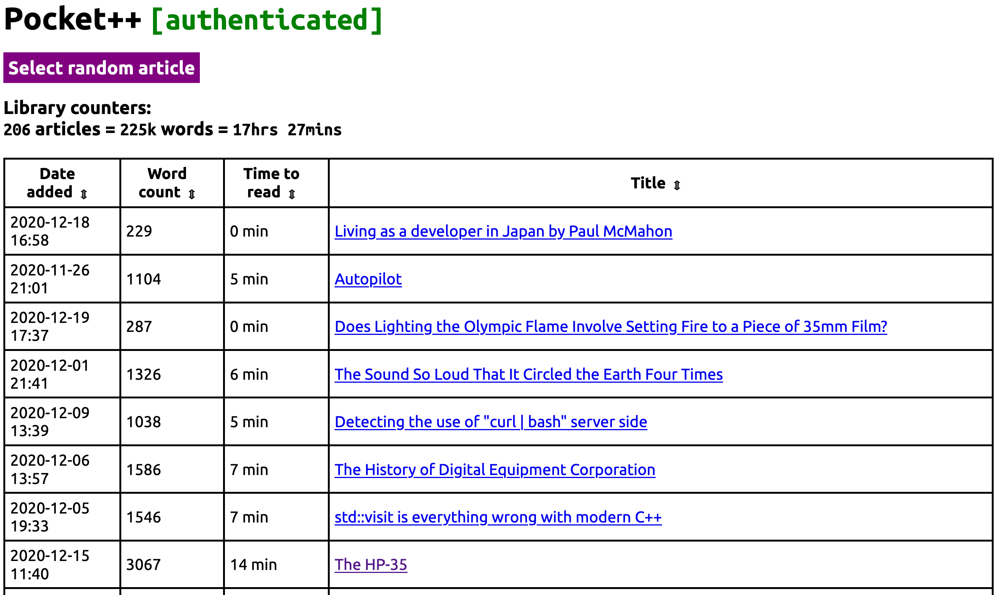

#  Pocket++
A web-app to extend Mozilla's Pocket for people dealing with dozens of saved content. 

Main features include:
* full list of saved (not archived) articles in form of sortable table
* time and count statistics - to track progress of reading and/or saving new stuff
* random article selection - when you just can't decide
* optional storing statistics in InfluxDB
  * example Grafana dashboard included in `grafana_dashboard/`

## Demo


## Installation
```
python3 -m pip install -r requirements.txt
```

## Config
You must use `config.yml` looking like this:

```yaml
---
app_cfg:
  debug: true
  port: 8080
  consumer_key: '$TOKEN'
  redirect_uri: 'http://localhost:8080/callback'
influx_cfg:
  enabled: true
  host: influx_host
  port: 8086
  db: ppp
  user: username
  pass: secretpass
redis_cfg:
  enabled: true

  is_sentinel: true
  sentinel_pass: CLIENT_PASS_TO_SENTINEL  
  sentinel_service: SENTINEL_SERVICE_NAME
  
  host: REDIS_HOSTNAME
  port: 6379
  ssl: True
  tls_skip_verify: True

  db: 0
  prefix: ppp_

  user: REDIS_USER
  pass: REDIS_PASS
```

You need `$TOKEN` being *consumer key* from https://getpocket.com/developer/apps/

## Usage
```
python3 ppp.py
```

## Development
You may want to use below syntax to skip getpocket.com authorization every time you restart app (or after it's autorestarted by CherryPy):
```
python3 ppp.py $REQUEST_TOKEN $ACCESS_TOKEN $USERNAME
```
`$REQUEST_TOKEN`, `$ACCESS_TOKEN`  and `$USERNAME` can be found in application log when `debug: true`.
